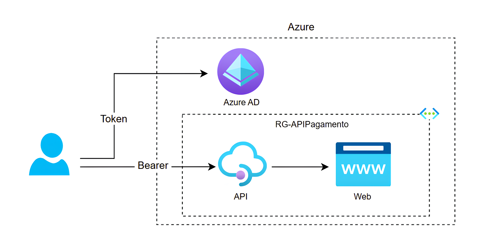
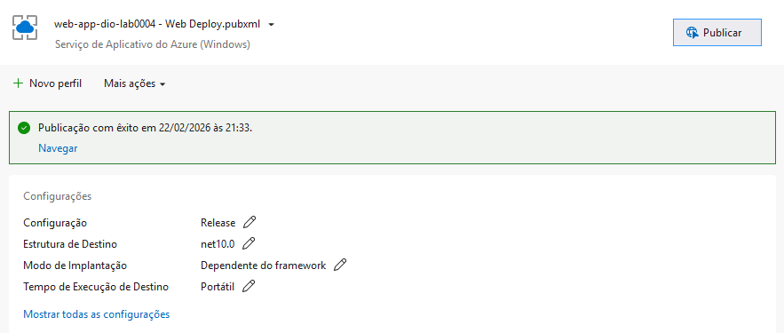
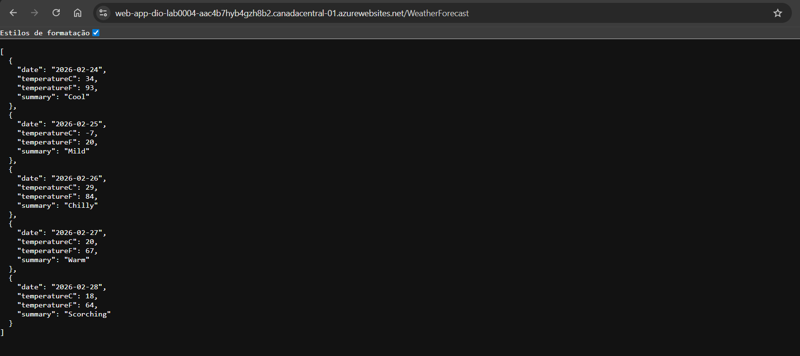
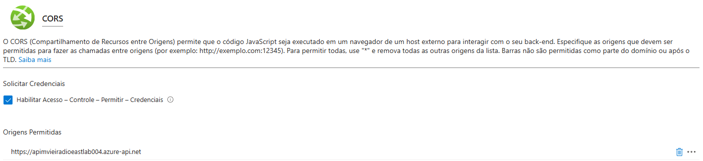
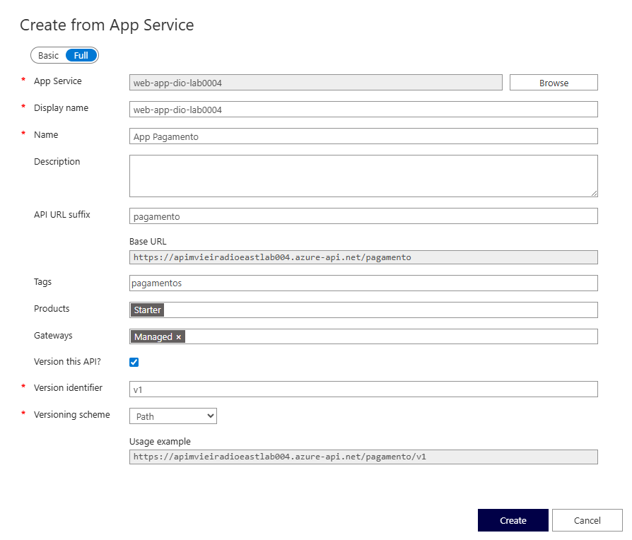
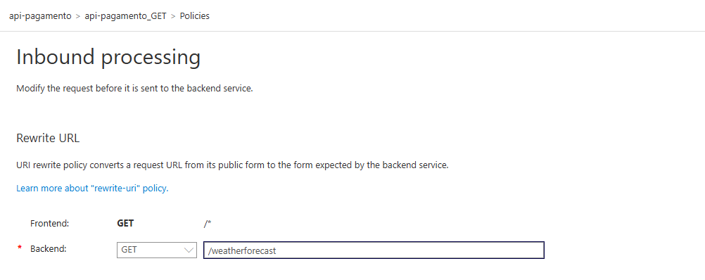
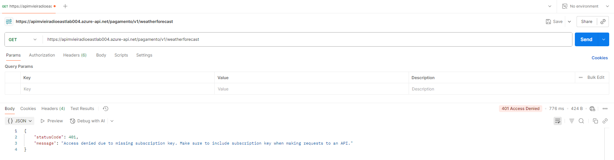

# API de Pagamentos com Azure API Management

## 📌 Sobre o Projeto

Este projeto foi desenvolvido durante o curso Microsoft Azure Cloud Native 2026, promovido pela Digital Innovation One (DIO). O desafio foca na criação e exposição de uma API de Pagamentos segura na Microsoft Azure.

O objetivo é demonstrar o ciclo de vida completo de uma API, desde o deploy no App Service até a governança avançada com API Management (APIM), controle de acesso por chaves e autenticação via JWT.

## Arquitetura do Projeto

A solução utiliza um modelo de segurança multicamadas. O gateway (APIM) atua como o único ponto de entrada, validando a origem das requisições e a identidade do chamador antes de encaminhar o tráfego para o backend.

## 🚀 Passo a Passo da Implementação

### 1. Backend e Deploy

O projeto iniciou com a criação de um Resource Group na Azure para hospedar os recursos. Foi desenvolvido uma API em .NET 10 e realizado o deploy para um Azure Web App.

**Deploy**: Realizado via Visual Studio.

 

**Teste Inicial**: Validação do endpoint padrão via navegador.

 

> Endpoint Backend: `https://web-app-dio-xxxx.azurewebsites.net/WeatherForecast`

### 2. Configuração do Gateway (APIM)

Para gerenciar a API, foi instanciado o Azure API Management Service.

**CORS**: Ativado no Web App para permitir apenas chamadas vindas do endereço do APIM.

 

**Versionamento**: Configurado como `v1` para suportar futuras atualizações sem quebrar o acesso dos clientes atuais.

 

**Políticas (Inbound)**: Implementação de rewrite-uri para direcionar as chamadas da raiz diretamente para o recurso `/weatherforecast`.

### 3. Camadas de Autorização

#### Nível 1: Subscription Keys (x-api-key)

Implementada a obrigatoriedade de uma chave de assinatura para consumo da API. Sem o header correto, o gateway retorna 401 Access Denied.

#### Nível 2: OAuth2 e JWT

Para um cenário real de pagamentos, a autenticação foi delegada ao Microsoft Entra ID, elevando o padrão de segurança com a validação de tokens JWT.

* App Registration: Criado sob o nome `app-gateway-mvieira` para gerenciar as credenciais de acesso.
* Roles & Permissions: Configuração de permissões específicas `reader` e `sendMenssage` para controlar as ações dos clientes.
* Expose API (Escopos): Configuração de Scopes para permitir que aplicações de terceiros solicitem acesso autorizado à API.
* API Permissions: Atribuição das permissões necessárias no manifesto do app para que o token JWT carregue as claims corretas.

#### Verificação de Autorização

No Postman, a autorização foi validada utilizando o tipo Bearer Token. O gateway APIM foi configurado com uma política de validação de JWT para inspecionar se o token enviado possui as permissões (roles) exigidas antes de liberar o acesso ao backend.

## Tecnologias Utilizadas

| Tecnologia | Finalidade |
| --- | --- |
| Azure Web App | Hospedagem da API backend (.NET 10). |
| Azure APIM | Gateway, gerenciamento de assinaturas e políticas de URI. |
| Microsoft Entra | (Antigo Azure AD) Gerenciamento de identidade e tokens JWT. |
| Postman | Testes de endpoints, headers e autenticação OAuth2. |

## 🔐 Segurança de Dados

> Nota: Todos os recursos, segredos de cliente e assinaturas do Azure utilizados neste laboratório foram desativados e removidos após a conclusão do projeto. As imagens e textos foram tratados para não exibir dados sensíveis do projeto.

## Autora

Milla Regina Lopes Vieira - [LinkedIn](https://www.linkedin.com/in/milla-regina-468020206/)